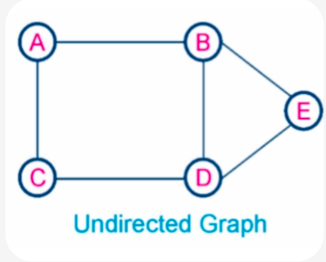
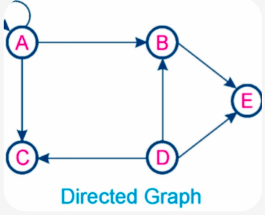
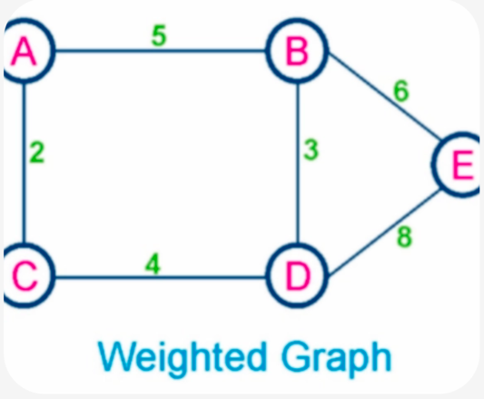
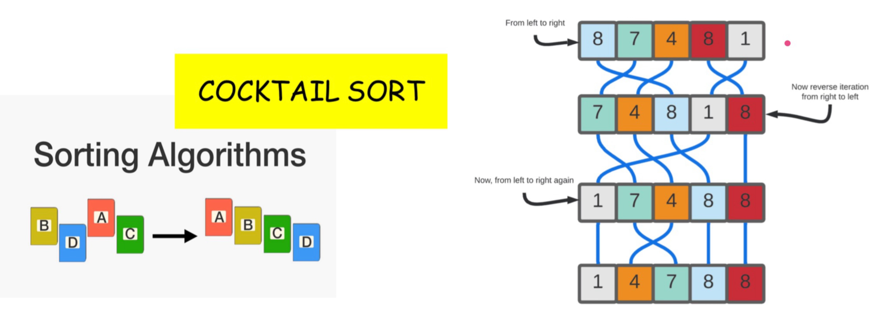

# Task 2: Self-Study - Graph Data Structure & Cocktail Sort Algorithm

**COMP8090SEF Data Structures and Algorithms**

**NAME:** **HE Xue (SID: 13927408)**

## 🎤 Topics

1. **Data Structure: Graph** - Undirected, Directed, and Weighted Graph Introductions and Implementations
2. **Algorithm: Cocktail Sort** - Cocktail Sort Key Characteristics, Possible Applications, Introductions and Implementations

## 📄 Files

| File                                              | Description                                                     |
|---------------------------------------------------|-----------------------------------------------------------------|
| `[Task2]_HEXue_13927408_Self_Study_Report.pdf`    | Study Report of Task 2                                          |
| `[Task2]_HEXue_13927408_Self_Study_Video_PPT.pdf` | PPT of Self-study                                               |
| `Data_Structures_Graph.py`                        | Graph Implementations (Undirected, Directed, Weighted)          |
| `Algorithm_Cocktail_sort.py`                      | Cocktail Sort Implementations |

## 🧑‍🏫 Introductions

### 🌟 What is Graph?

A graph is a data structure consisting of vertices (nodes) and edges (connections). 
This implementation includes three types:

1. **Undirected Graph**

Edge Direction: Bidirectional (A-B)

Example Use Case: Social network friendships



2. **Directed Graph**

Edge Direction: Unidirectional (A→B)

Example Use Case: Task dependencies



3. **Weighted Graph** 

Edge Direction: Either Directed & Undirected + weight 

Example Use Case: GPS navigation (distance)




### 🌟 What is Cocktail Sort Algorithm?
Cocktail Sort (also called Shaker Sort or Bidirectional Bubble Sort) is a variation of Bubble
Sort that sorts in both directions. It works by:

1. Forward pass: Moving the largest unsorted element to the right end
2. Backward pass: Moving the smallest unsorted element to the left end
3. Early termination: Stops if no swaps occur in a complete pass



## 😼 How to Run (User Guide)

### Prerequisites
Python

### Run Data_Structures_Graph Demo
```bash
cd Task2_SelfStudy
Data_Structures_Graph.py
```

What will demonstrate:
- UndirectedGraph - For mutual relationships
- DirectedGraph - For one-way relationships with topological sort
- WeightedGraph - For shortest path with Dijkstra's algorithm

### Run Algorithm_Cocktail_sort Demo
```bash
cd Task2_SelfStudy
Algorithm_Cocktail_sort.py
```

What will demonstrate:
- cocktail_sort(arr) - The main sorting function
- 5 demonstration examples showing different cases
- Examples with numbers and strings

## Video Link
https://www.youtube.com/watch?v=1EdxCD77W2k&t=150s

## GitHub Repository
https://github.com/Xuewaonline/HEXue_13927408_COMP8090SEF_IndividualProject/tree/main/Task2_SelfStudy
